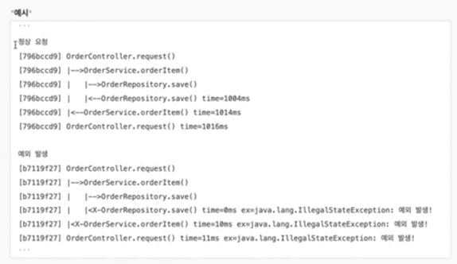

### Spring-Advance

 

#### 요구사항
- depth가 진행될 때마다 로그 출력
- 예외 발생 시 스택트레이스를 log로 출력
- 임의 생성된 traceId를 로그에 함께 출력
- 메서드가 완료되었을 때 소요된 시간을 로그에 함께 출력
- 단, 로그를 위해 비즈니스 로직 동작이 변경돼선 안됨

#### 사용 기술
- thread local -> 한 쓰레드 내에서의 depth 유지 
- reactor hooks -> 쓰레드가 바뀔 때 depth 정보 복사